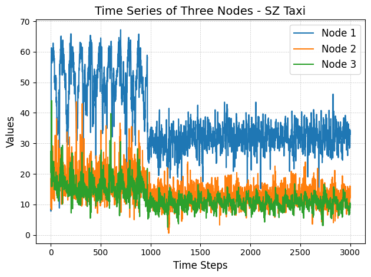
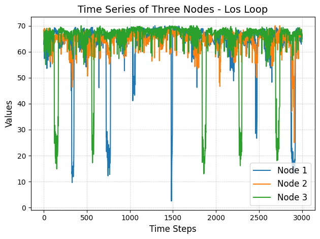
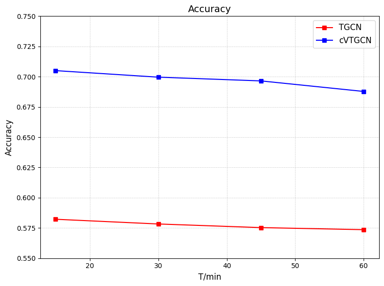
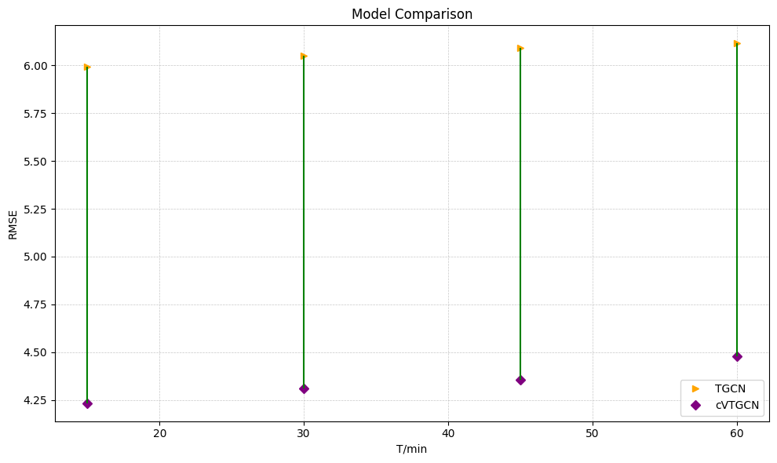
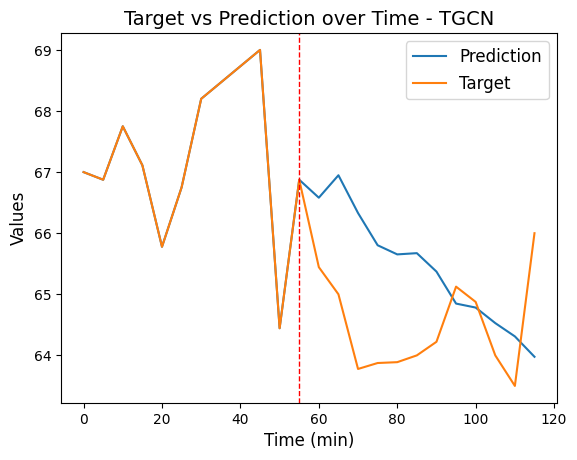
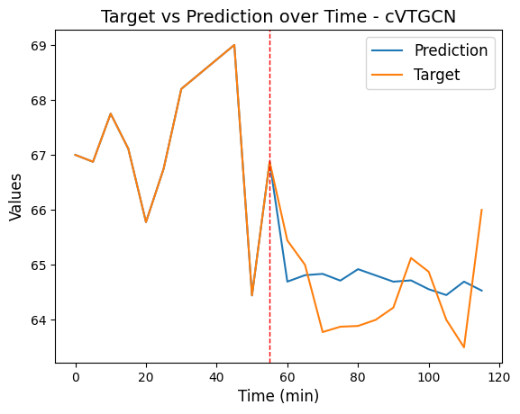
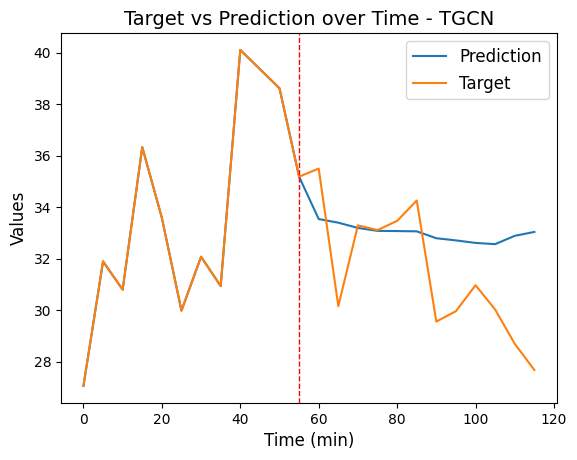
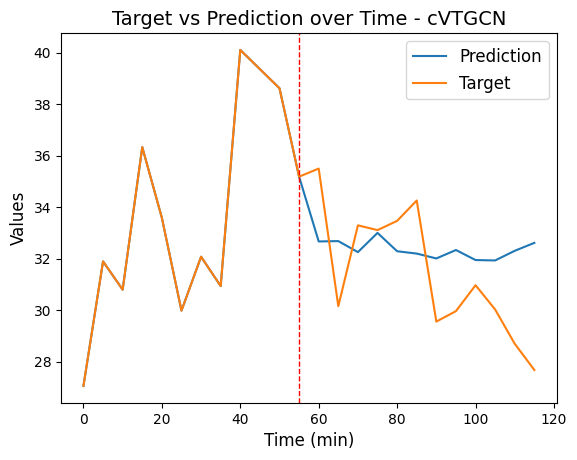

# Covariance-Temporal-GCN-for-Traffic-Forecasting

A cutting-edge traffic prediction model leveraging temporal graph structures to model spatial and temporal dependencies within traffic networks. This framework utilizes covariance-driven feature analysis, eigenvalue decomposition, and attention mechanisms to capture dynamic patterns, enabling accurate and scalable traffic forecasting. Tested on real-world datasets like SZ-Taxi and Los-Loop, it outperforms traditional models in accuracy and robustness. You can access the project report [here](/Project%20Report.pdf).


## Getting Started
Follow the steps below to run this project locally for development and testing.

### Prerequisites
Ensure the following libraries and frameworks are installed:

- PyTorch
- NumPy
- Matplotlib


### Installation
- Clone the repository:

```bash
git clone https://github.com/Vamsi995/Covariance-Temporal-GCN-for-Traffic-Forecasting.git
cd Covariance-Temporal-GCN-for-Traffic-Forecasting
```

- Install Dependencies:
```bash
pip install -r requirements.txt
```

### Usage

- Train and evaluate the model:

```bash
python train.py --config los_loop --hidden_dim 32 --epochs 100
```

- Run evaluations:

```bash
python evaluate.py --dataset sz_taxi --hidden_dim 32 --weights_path ../cvtgcn.pkl
```

### Datasets
The model is validated on:

- **SZ-Taxi**: 156 major roads in Shenzhen, traffic speeds sampled every 15 minutes.
- **Los-Loop**: 207 sensors in Los Angeles highways, data sampled every 5 minutes.

SZ-Taxi                    | Los-Loop 
:-------------------------:|:-------------------------:
 | 


## Results

Accuracy                   | RMSE 
:-------------------------:|:-------------------------:
  |  


TGCN - SZ-Taxi             | cVTGCN - SZ-Taxi
:-------------------------:|:-------------------------:
  |  

TGCN - Los-Loop            | cVTGCN - Los-Loop
:-------------------------:|:-------------------------:
  |  


## Built With

* [PyTorch](https://pytorch.org/) - Deep Learning Framework
* [SpatioTemporal Neural Networks](https://github.com/andrea-cavallo-98/STVNN)
* [TGCN](https://github.com/lehaifeng/T-GCN/tree/master)


## Authors
- [Sai Vamsi Alisetti](https://github.com/Vamsi995)
- [Vikas Kalagi](https://github.com/vikaskalagi)
